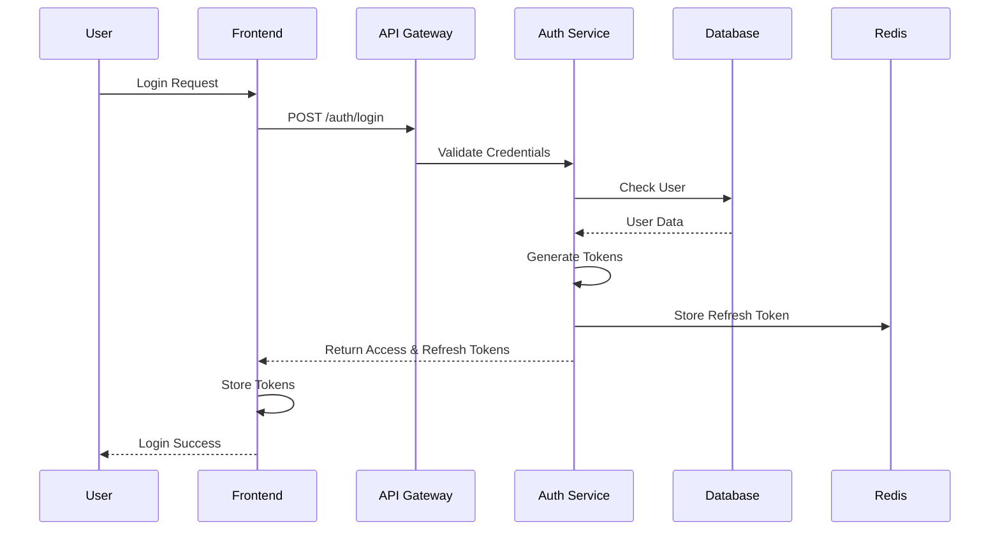
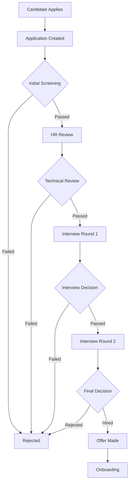
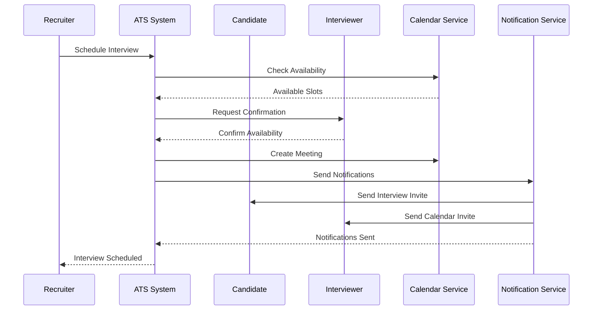
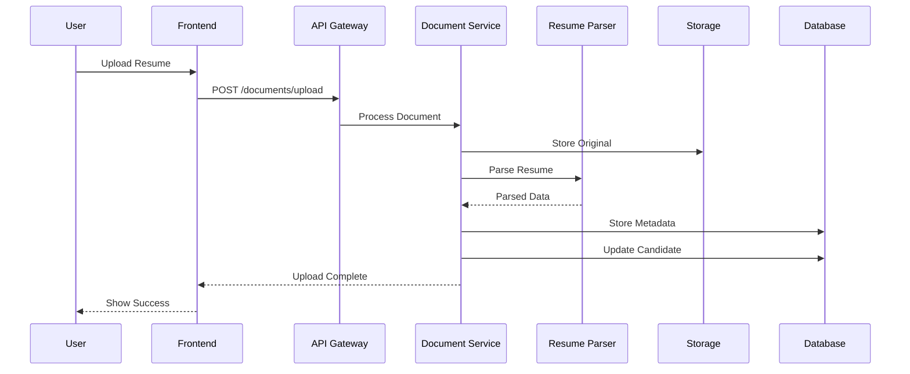
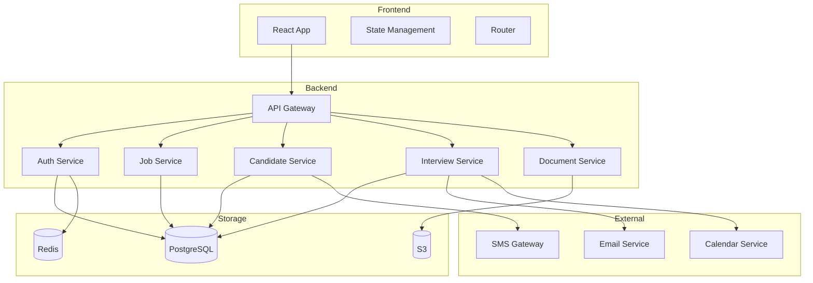
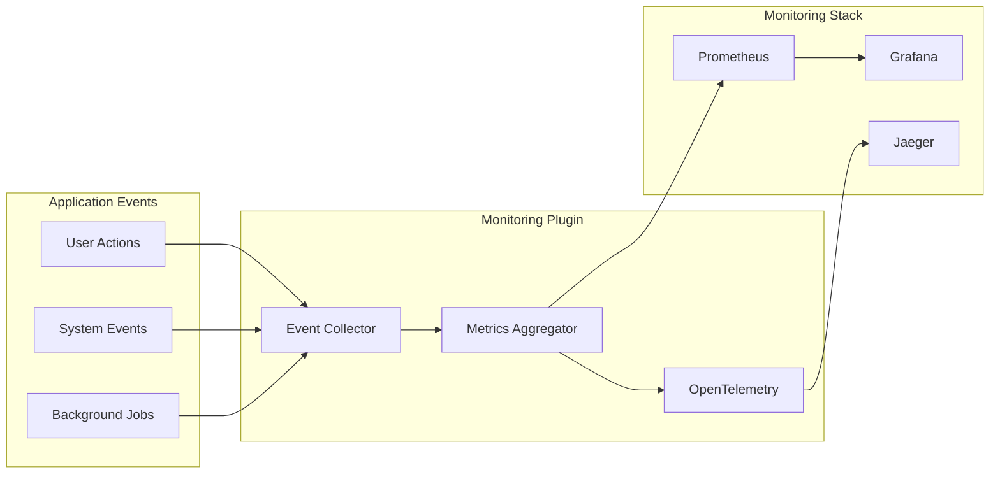
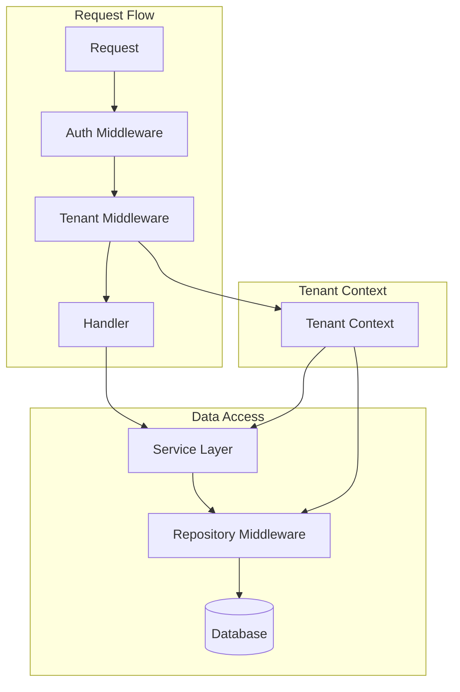

# ATS (Applicant Tracking System) Documentation
## System Overview & Domain Architecture

### 1. Core Domains

#### 1.1 Company Management
```plaintext
Purpose: Manages company-specific settings and multi-tenancy
Key Concepts:
- Company profile and settings
- Department structure
- Team management
- Subscription/plan management
- Company-specific configurations

Responsibilities:
- Company registration and setup
- Department hierarchy
- User role management within company context
- Company settings management
```

#### 1.2 User Management
```plaintext
Purpose: Handles user authentication, authorization, and profile management
Key Concepts:
- User authentication
- Role-based access control
- User profiles
- Session management
- Multi-factor authentication

Responsibilities:
- User registration and authentication
- Role and permission management
- Password management
- Profile management
- Session handling
```

#### 1.3 Job Management
```plaintext
Purpose: Manages job postings and requisitions
Key Concepts:
- Job requisitions
- Job postings
- Job templates
- Hiring workflows
- Position management

Responsibilities:
- Job creation and publishing
- Template management
- Job status tracking
- Hiring pipeline configuration
- Job search and filtering
```

#### 1.4 Candidate Management
```plaintext
Purpose: Handles candidate information and tracking
Key Concepts:
- Candidate profiles
- Resume parsing
- Candidate sourcing
- Candidate status
- Talent pool

Responsibilities:
- Candidate profile management
- Resume processing
- Candidate search and filtering
- Status tracking
- Communication history
```

#### 1.5 Application Pipeline
```plaintext
Purpose: Manages the application process and workflow
Key Concepts:
- Application stages
- Pipeline configuration
- Stage transitions
- Application status
- Kanban board

Responsibilities:
- Application workflow management
- Stage transition handling
- Status updates
- Pipeline visualization
- Application tracking
```

#### 1.6 Interview Management
```plaintext
Purpose: Handles interview scheduling and feedback
Key Concepts:
- Interview scheduling
- Interviewer assignment
- Feedback collection
- Interview types
- Evaluation criteria

Responsibilities:
- Interview scheduling
- Feedback collection
- Interviewer management
- Interview type configuration
- Evaluation management
```

### 2. Supporting Domains

#### 2.1 Document Management
```plaintext
Purpose: Handles document storage and processing
Responsibilities:
- Document upload and storage
- Resume parsing
- File format handling
- Document versioning
- Access control
```

#### 2.2 Communication
```plaintext
Purpose: Manages all system communications
Responsibilities:
- Email notifications
- SMS notifications
- Communication templates
- Communication history
- Bulk communications
```

#### 2.3 Analytics & Reporting
```plaintext
Purpose: Provides insights and reporting capabilities
Responsibilities:
- Recruitment metrics
- Performance analytics
- Custom reports
- Dashboard management
- Data export
```

### 3. Technical Architecture

#### 3.1 Core Components
```plaintext
Frontend:
- React 18+
- TypeScript
- React Query
- React Router
- Mantine UI

Backend:
- Go 1.20+
- Gin Web Framework
- GORM
- PostgreSQL
- Redis

Monitoring:
- OpenTelemetry
- Prometheus
- Custom monitoring plugin
```

#### 3.2 Key Features
```plaintext
Authentication:
- JWT-based authentication
- Refresh token mechanism
- MFA support
- Session management

Authorization:
- Role-based access control
- Resource-level permissions
- Company isolation
- Action-based permissions

Data Management:
- Multi-tenancy
- Data isolation
- Audit logging
- Data encryption
```

### 4. System Integration Points

#### 4.1 External Integrations
```plaintext
Authentication:
- SSO providers
- OAuth2 services

Communication:
- Email service providers
- SMS gateways
- Calendar systems

Document Processing:
- Resume parsing services
- Document storage services
- OCR services
```

#### 4.2 API Architecture
```plaintext
REST API:
- Versioned endpoints
- Structured responses
- Error handling
- Rate limiting

WebSocket:
- Real-time updates
- Notification delivery
- Status changes
```

### 5. Development Guidelines

#### 5.1 Code Organization
```plaintext
Project Structure:
/cmd             # Application entrypoints
/internal        # Private application code
/pkg             # Public libraries
/web             # Frontend application
/config          # Configuration files
/scripts         # Build and maintenance scripts
```

#### 5.2 Development Practices
```plaintext
Standards:
- Code formatting (gofmt, prettier)
- Error handling patterns
- Logging standards
- Testing requirements

Processes:
- Code review requirements
- Testing requirements
- Documentation requirements
- Version control practices
```

### 6. Deployment & Operations

#### 6.1 Deployment
```plaintext
Environments:
- Development
- Staging
- Production

Configuration:
- Environment-based settings
- Secret management
- Feature flags
- Deployment procedures
```

#### 6.2 Monitoring & Maintenance
```plaintext
Monitoring:
- Application metrics
- System metrics
- Business metrics
- Error tracking
- Performance monitoring

Maintenance:
- Backup procedures
- Update processes
- Security patches
- Database maintenance
```

### 7. Security Considerations

#### 7.1 Security Measures
```plaintext
Data Security:
- Encryption at rest
- Encryption in transit
- Data access controls
- Audit logging

Application Security:
- Input validation
- Output encoding
- CSRF protection
- XSS prevention
- Rate limiting
```

### Diagrams  


1. **Authentication Flow**


2. **Job Application Pipeline**


3. **Interview Scheduling Flow**


4. **Document Processing Flow**


5. **System Architecture Overview**


6. **Event Flow and Monitoring**


7. **Data Flow in Multi-tenant Environment**

